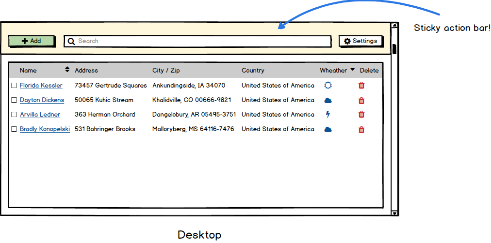
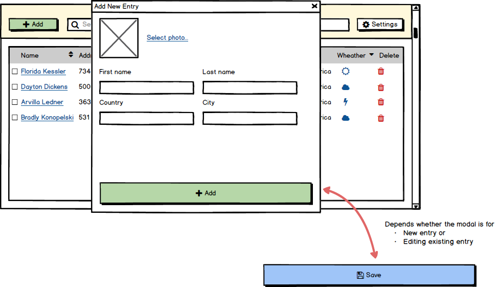
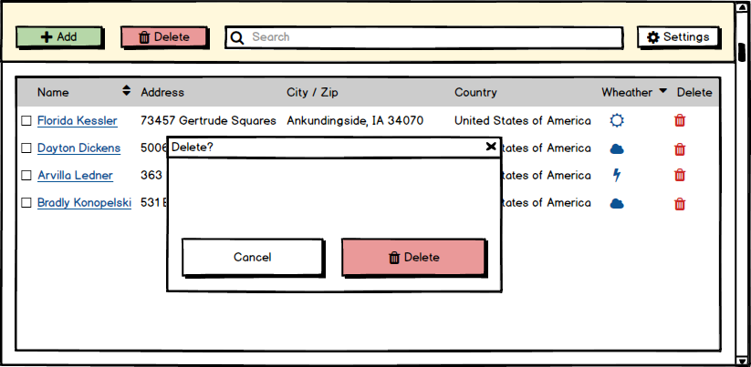
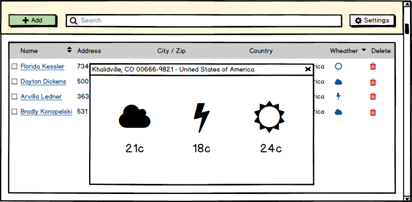

# Quantox React Internship 2021, Group 4

This project is an effort to learn React basics through a single, "simple" and focused project implementation.

## Goal

Goal of the project is to implement a "simple" address book - a known concept and easy to get a logical grasp of. Do not be fooled by its "simplicity" - there will be a lot of opportunities to exercise some of the best programming practice while implementing this project, some of which are:

- Basic React concepts
  - Implementing function components 
  - [React Hooks](https://reactjs.org/docs/hooks-intro.html) (`useState`, `useEffect`, `useMemo`, `useRef`, ...)
  - [React Portals](https://reactjs.org/docs/portals.html) (leveraged using [Headless UI](https://headlessui.dev/))
  - [React Testing Library](https://testing-library.com/docs/react-testing-library/intro/)
  - State management using [MobX](https://mobx.js.org/README.html)
  - Many more...
- Form validation using [React Hook Form](https://react-hook-form.com/get-started)
- Component styling and responsive design using [Tailwind CSS](https://tailwindcss.com/docs/installation)
- [Debouncing](https://css-tricks.com/debouncing-throttling-explained-examples/) of events (using [lodash](https://lodash.com/docs))
- Asynchronous programming using `async` and `await`
- Working with [Fetch API](https://developer.mozilla.org/en-US/docs/Web/API/Fetch_API) to use both "internal" and external API
- Working with collections using [lodash](https://lodash.com/docs)
- Working with and understanding the benefits of HMR (Hot Module Reload)
- Debugging code using both browser's Developer Tools and VSCode debugger
- Internationalization using [react-i18next](https://react.i18next.com/)
- Documenting code using [JSdoc](https://jsdoc.app/)
- Many more...

## Features

### List

Main "screen" consists of `[+ Add]` button and `Search` input at the top and tabular list of entries bellow. It is possible to"
- Add new entry
- Search entries (server-side)
- Sort entries (server-side)
- Edit entries
- Delete entries
- Fetch weather data for particular entry (using external API)

#### API

- `GET /api/entries`
- `GET /api/entries?serach=:query`

### Add / Edit / Delete

Both adding new entry and editing existing one is done using the same component(s) implemented as modal with form validation.

#### API

- `POST /api/entries`
- `POST /api/v2/entries` - multipart/form-data
- `PUT /api/entries/:uuid`
- `PUT /api/v2/entries/:uuid` - multipart/form-data
- `DELETE /api/entries/:uuid`

### New entry - POST /api/v2/entries

This API receives `multipart/form-data`:

| Field        | Description                                                               | Required |
|--------------|---------------------------------------------------------------------------|----------|
| `avatar`     | binary content (file)                                                     | No       |
| `avatarUrl`  | path of previous avatar; if passed, this will be used instead of `avatar` | No       |
| `firstName`  | text/plain                                                                | **Yes**  |
| `lastName`   | text/plain                                                                | No       |
| `country`    | text/plain                                                                | No       |
| `city`       | text/plain                                                                | No       |
| `street`     | text/plain                                                                | No       |
| `postalCode` | text/plain                                                                | No       |
| `birthDate`  | text/plain (ISO string representation of `Date` instance)                 | No       |
| `email`      | text/plain                                                                | No       |

Upon successful call, status `200` is returned along with JSON carrying all info about newly-created entry.

### Update existing entry - PUT /api/v2/entries/:uuid 

This API receives `multipart/form-data`:

| Field        | Description                                                               | Required |
|--------------|---------------------------------------------------------------------------|----------|
| `avatar`     | binary content (file)                                                     | No       |
| `avatarUrl`  | path of previous avatar; if passed, this will be used instead of `avatar` | No       |
| `firstName`  | text/plain                                                                | **Yes**  |
| `lastName`   | text/plain                                                                | No       |
| `country`    | text/plain                                                                | No       |
| `city`       | text/plain                                                                | No       |
| `street`     | text/plain                                                                | No       |
| `postalCode` | text/plain                                                                | No       |
| `birthDate`  | text/plain (ISO string representation of `Date` instance)                 | No       |
| `email`      | text/plain                                                                | No       |

Upon successful call, status `200` is returned along with JSON carrying all info about changed entry.

Deletion is done per entry using the delete icon or by selecting multiple entries and clicking on newly-shown `[- Delete]` button. Both delete "flows" are accompanied by a confirmation modal.

### Weather Data

Basic weather data is fetched using external API ([Open Weather API](https://openweathermap.org/api)), but only for visible rows / slight delay (lazy loading) and represented with an icon.

Clicking on the weather icon shows Weather modal with detailed Weather data for that particular address entry.

## Technical Details

### Tooling

- [Webpack](https://webpack.js.org/)
- [ts-loader](https://github.com/TypeStrong/ts-loader)
- [ESLint](https://eslint.org/)
- [React Refresh Webpack Plugin](https://github.com/pmmmwh/react-refresh-webpack-plugin)

### Backend

- [Express](https://expressjs.com/) 
- [Node MySQL 2](https://github.com/sidorares/node-mysql2)

### Frontend
- [React](https://reactjs.org/docs/getting-started.html)
- [MobX](https://mobx.js.org/README.html)
- [React Testing Library](https://testing-library.com/docs/react-testing-library/intro/)
- [Tailwind CSS](https://tailwindcss.com/docs/installation)
- [Headless UI](https://headlessui.dev/)
- [React Hook Form](https://react-hook-form.com/get-started)
- [react-i18next](https://react.i18next.com/)
- [lodash](https://lodash.com/docs)
